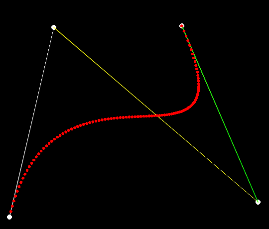
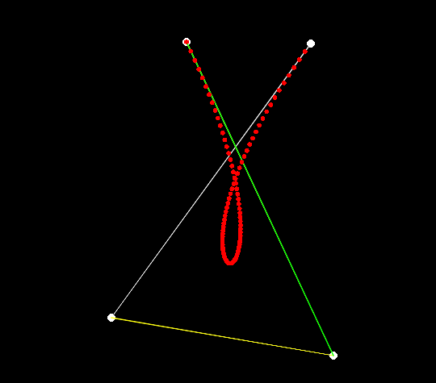

# BezierCurve
Simple cubic bezier curve creator. Scripted in LUA using Love2D.

### Usage
- **right mouse click:** add a point to the screen
- **left click:** reset screen

<<<<<<< HEAD

=======
### How to run
- download and follow the instructions here https://love2d.org/wiki/Getting_Started
- alternatively download the executable and dll files from build folder

>>>>>>> origin/master
